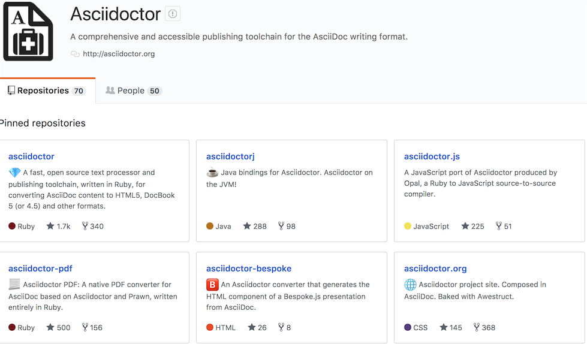

== 图片

可以简单的使用

或者像这样

.Asciidoctor Github Page
[#page]
[caption="来个标题:",link=https://github.com/asciidoctor]

我也可以环绕image:pic/play.png[]使用

image:pic/icon.png[icon,15,15,role="right']我也可以在最右边

http://asciidoctor.org/docs/user-manual/#putting-images-in-their-place[所有的图片的格式]